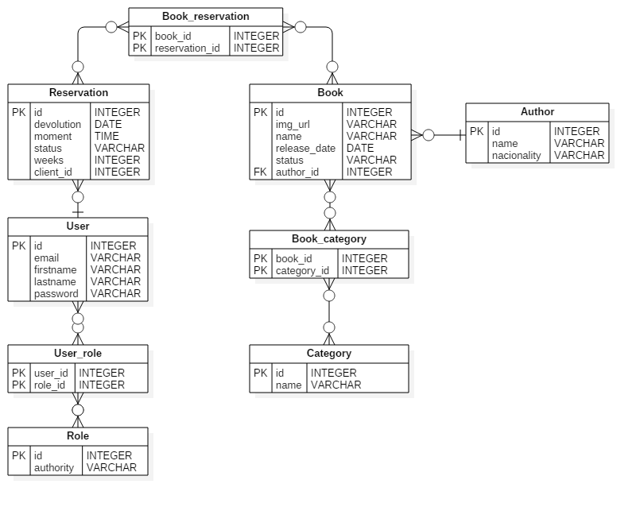

<h1 align="center">
📚<br>Bookstore Interact
</h1>

## 📦 Projeto

 Este repositório é um projeto que contempla um sistema de livraria, sendo possível cadastrar e admnistrar livros e usuários assim como disponibilizar a reserva de livros. A intenção do projeto é dispor o conhecimento em recursos necessário para criação de aplicações Web que se comunicam com bases de dados, o mesmo é divido em duas partes, backend e frontend, no qual ambos funcionam de maneira independente apesar do backend popular o frontend. O sistema foi pensando de maneira que o usuário cliente ou operador apenas controle os livros e pessoas, sendo assim outras entidades estáticas como autores, categorias de livro e roles de usuário serão inicializadas no boot do projeto ou no banco de dados.

 <details>
    <summary><u>Rotas da API (restante das requisições na pasta /postman collections)</u></summary>

| Verbo HTTP 	|                  CRUD                  	|                         URL                        	|                                   Valor                                   	|
|:----------:	|:--------------------------------------:	|:--------------------------------------------------:	|:-------------------------------------------------------------------------:	|
|     GET    	|              Read all books            	|             localhost:8080/api/v1/books            	|                                    -/-                                    	|
|     GET    	|             Read book by id            	|        localhost:8080/api/v1/books/${valor}        	|                                ID do livro                                	|
|     GET    	|           Read book by status          	|     localhost:8080/api/v1books?booked=${valor}     	|                        0 = disponível 1 = reservado                       	|
|    POST    	|               Create book              	|             localhost:8080/api/v1/books            	| raw/JSON: { name, releaseDate, imgUrl, author { id }, categories { id } } 	|
|     PUT    	|               Update book              	|        localhost:8080/api/v1/books/${valor}        	|                 ID do livro  raw/JSON: { dados de insert }                	|
|    POST    	| Create reservation, update book status 	|         localhost:8080/api/v1/reservations         	|              raw/JSON:  { weeks, cliente { id }, books { id }             	|
|     PUT    	| Update reservation, update book status 	| localhost:8080/api/v1/reservations/return/${valor} 	|                        ID do livro a ser devolvido                        	| 
|	 POST		|			Authenticate user				|		localhost:8080/api/v1/authenticate				|						raw/JSON: { email, password }							|
|	 POST		|			   Create user					|		   localhost:8080/api/v1/register				| 		raw/JSON: { firstname, lastname, email, password, roles { id } }		| 

 </details>

 <br>

 <h3 align="center">Modelo relacional</h3>

<p align="right">
 
</p>

 <br>

[](https://github.com/anuraghazra/github-readme-stats)


---

## 🛠️ Desenvolvimento

**Linguagens**

<p>


</p>

**Frameworks & Libraries**

<p>


</p>

**Banco de dados**

<p>


</p>

**DevOps**

<p>


</p>

**Ferramentas de desenvolvimento**

<p>


</p>

---

## ⚙️ Configuração

<h3>Backend</h3>

<p> Projeto criado e desenvolvido na IDE STS4, a versão adaptada do Eclipse voltada para desenvolvimento Spring. Build e dependências em Maven, linguagem Java 17, Spring Boot 3.0.2, packaging Jar, as dependências estão abaixo no pom.xml.
</p>

<p>Para funcionar apropriadamente, alterar os dados contidos nos arquivos .properties com as informações de conexão ao banco de dados.
</p>

application.properties

```
spring.profiles.active= < dev OR test >
spring.jpa.open-in-view=true

//secret criado usando guidgenerator.com
jwt.secret:6D5A7134743777217A25432A46294A404E635266556A586E3272357538782F41

```

application-dev.properties

```
spring.datasource.driver-class-name=org.postgresql.Driver
spring.datasource.url=jdbc: < postgresql://address:port/db-name >
spring.datasource.username= < usuário postgres >
spring.datasource.password= < senha postgres >

spring.jpa.properties.hibernate.jdbc.lob.non_contextual_creation=true
spring.jpa.hibernate.ddl-auto=create
spring.jpa.show-sql=true
spring.jpa.properties.hibernate.format_sql=true
spring.jpa.database=postgresql
spring.jpa.database-platform=org.hibernate.dialect.PostgreSQLDialect

```
<br>
Dependências do projeto.

<details>
    <summary><u>pom.xml</u></summary>

```
<?xml version="1.0" encoding="UTF-8"?>
<project xmlns="http://maven.apache.org/POM/4.0.0" xmlns:xsi="http://www.w3.org/2001/XMLSchema-instance" xsi:schemaLocation="http://maven.apache.org/POM/4.0.0 https://maven.apache.org/xsd/maven-4.0.0.xsd">
	<modelVersion>4.0.0</modelVersion>
	<parent>
		<groupId>org.springframework.boot</groupId>
		<artifactId>spring-boot-starter-parent</artifactId>
		<version>3.0.2</version>
		<relativePath /> <!-- lookup parent from repository -->
	</parent>
	<groupId>com.poletto</groupId>
	<artifactId>bookstore</artifactId>
	<version>0.0.1-SNAPSHOT</version>
	<name>bookstore</name>
	<description>bookstore project-interact</description>
	<properties>
		<java.version>17</java.version>
	</properties>
	<dependencies>
		<dependency>
			<groupId>org.springframework.boot</groupId>
			<artifactId>spring-boot-starter-data-jpa</artifactId>
		</dependency>
		<dependency>
			<groupId>org.springframework.boot</groupId>
			<artifactId>spring-boot-starter-security</artifactId>
		</dependency>
		<dependency>
			<groupId>org.springframework.boot</groupId>
			<artifactId>spring-boot-starter-web</artifactId>
		</dependency>
		<dependency>
			<groupId>com.h2database</groupId>
			<artifactId>h2</artifactId>
			
		</dependency>
		<dependency>
			<groupId>org.postgresql</groupId>
			<artifactId>postgresql</artifactId>
			
		</dependency>
		<dependency>
			<groupId>org.springframework.boot</groupId>
			<artifactId>spring-boot-starter-test</artifactId>
			<scope>test</scope>
		</dependency>
		<dependency>
			<groupId>org.springframework.security</groupId>
			<artifactId>spring-security-test</artifactId>
			<scope>test</scope>
		</dependency>
		<dependency>
			<groupId>io.jsonwebtoken</groupId>
			<artifactId>jjwt-api</artifactId>
			<version>0.11.5</version>
		</dependency>
		<dependency>
			<groupId>io.jsonwebtoken</groupId>
			<artifactId>jjwt-impl</artifactId>
			<version>0.11.5</version>
		</dependency>
		<dependency>
			<groupId>io.jsonwebtoken</groupId>
			<artifactId>jjwt-jackson</artifactId>
			<version>0.11.5</version>
		</dependency>
	</dependencies>
	<build>
		<plugins>
			<plugin>
				<groupId>org.springframework.boot</groupId>
				<artifactId>spring-boot-maven-plugin</artifactId>
			</plugin>
		</plugins>
	</build>
</project>
```

</details>

<br>
Arquivo para importação de dados de teste na inicialização do app. src/main/resources

<details>
    <summary><u>import.sql</u></summary>

```
--usuarios

INSERT INTO tb_user VALUES (default, 'leo@gmail.com', 'Leonardo', 'Poletto Casagrande', '$2a$10$YYdXGIgspPM/gnVuk1S/m.NqKmE3Gg3gkWLk74PRlpnnqELnpyW7O');
INSERT INTO tb_user VALUES (default, 'admin@gmail.com', 'Admin', 'Admin', '$2a$10$eACCYoNOHEqXve8aIWT8Nu3PkMXWBaOxJ9aORUYzfMQCbVBIhZ8tG');
INSERT INTO tb_user VALUES (default, 'john@gmail.com', 'John', 'Doe', '$2a$10$eACCYoNOHEqXve8aIWT8Nu3PkMXWBaOxJ9aORUYzfMQCbVBIhZ8tG');
INSERT INTO tb_user VALUES (default, 'customer@gmail.com', 'Customer', 'Customer', '$2a$10$eACCYoNOHEqXve8aIWT8Nu3PkMXWBaOxJ9aORUYzfMQCbVBIhZ8tG');

INSERT INTO tb_role (authority) VALUES ('ROLE_CUSTOMER');
INSERT INTO tb_role (authority) VALUES ('ROLE_OPERATOR');
INSERT INTO tb_role (authority) VALUES ('ROLE_ADMIN');

INSERT INTO tb_user_role (user_id, role_id) VALUES (1, 1);
INSERT INTO tb_user_role (user_id, role_id) VALUES (1, 2);
INSERT INTO tb_user_role (user_id, role_id) VALUES (1, 3);
INSERT INTO tb_user_role (user_id, role_id) VALUES (2, 1);
INSERT INTO tb_user_role (user_id, role_id) VALUES (2, 2);
INSERT INTO tb_user_role (user_id, role_id) VALUES (2, 3);
INSERT INTO tb_user_role (user_id, role_id) VALUES (3, 1);
INSERT INTO tb_user_role (user_id, role_id) VALUES (3, 2);
INSERT INTO tb_user_role (user_id, role_id) VALUES (4, 1);

--livros

INSERT INTO tb_category VALUES (default, 'thriller');
INSERT INTO tb_category VALUES (default, 'fantasy');
INSERT INTO tb_category VALUES (default, 'romance');
INSERT INTO tb_category VALUES (default, 'engineering');
INSERT INTO tb_category VALUES (default, 'adventure');
INSERT INTO tb_category VALUES (default, 'terror');
INSERT INTO tb_category VALUES (default, 'biography');
INSERT INTO tb_category VALUES (default, 'comedy');
INSERT INTO tb_category VALUES (default, 'children and family');
INSERT INTO tb_category VALUES (default, 'nature');
INSERT INTO tb_category VALUES (default, 'politics');

INSERT INTO tb_author VALUES (default, 'United States', 'Stephen King');
INSERT INTO tb_author VALUES (default, 'United States', 'Robert Cecil Martin');
INSERT INTO tb_author VALUES (default, 'United States', 'H. P. Lovecraft');
INSERT INTO tb_author VALUES (default, 'United Kingdom', 'J. K. Rowling');
INSERT INTO tb_author VALUES (default, 'United States', 'George R. R. Martin');
INSERT INTO tb_author VALUES (default, 'Brazil', 'Ailton Krenak');

INSERT INTO tb_book VALUES (default, 'https://m.media-amazon.com/images/I/61dOYnvCQ2L._SY344_BO1,204,203,200_QL70_ML2_.jpg', 'Outsider', '2018-05-22', 'AVAILABLE', 1);  --'AVAILABLE'
INSERT INTO tb_book VALUES (default, 'https://m.media-amazon.com/images/I/41SH-SvWPxL.jpg', 'Clean Code', '2008-08-01', 'AVAILABLE', 2);
INSERT INTO tb_book VALUES (default, 'https://m.media-amazon.com/images/I/41XGebnVM+L._SY346_.jpg', 'The Colour Out of Space', '1927-09-05', 'AVAILABLE', 3);
INSERT INTO tb_book VALUES (default, 'https://m.media-amazon.com/images/I/5165He67NEL._SY346_.jpg', 'Harry Potter and the Philosophers Stone', '1997-06-26', 'AVAILABLE', 4);
INSERT INTO tb_book VALUES (default, 'https://m.media-amazon.com/images/I/51D+-f5UcDL.jpg', 'A Game of Thrones', '1996-08-01', 'AVAILABLE', 5);
INSERT INTO tb_book VALUES (default, 'https://m.media-amazon.com/images/P/B07RNQB854.01._SCLZZZZZZZ_SX500_.jpg', 'Ideias para Adiar o Fim do Mundo', '2020-07-24', 'AVAILABLE', 6);


INSERT INTO tb_book_category VALUES (1, 1);
INSERT INTO tb_book_category VALUES (1, 6);
INSERT INTO tb_book_category VALUES (2, 4);
INSERT INTO tb_book_category VALUES (3, 6);
INSERT INTO tb_book_category VALUES (4, 2);
INSERT INTO tb_book_category VALUES (4, 5);
INSERT INTO tb_book_category VALUES (5, 2);
INSERT INTO tb_book_category VALUES (5, 5);
INSERT INTO tb_book_category VALUES (5, 11);
INSERT INTO tb_book_category VALUES (6, 10);

--reservas

INSERT INTO tb_reservation (moment, client_id, weeks, devolution, status) VALUES ('2023-02-18T17:38', 4, 2, '2023-03-04', default);
INSERT INTO tb_reservation (moment, client_id, weeks, devolution, status) VALUES ('2023-02-02T09:22', 2, 1, '2023-02-09', default);
INSERT INTO tb_reservation (moment, client_id, weeks, devolution, status) VALUES ('2023-01-25T13:59', 3, 3, '2023-02-15', default);
INSERT INTO tb_reservation (moment, client_id, weeks, devolution, status) VALUES ('2022-12-27T10:05', 2, 2, '2023-01-10', default);
INSERT INTO tb_reservation (moment, client_id, weeks, devolution, status) VALUES ('2023-02-07T15:13', 4, 4, '2023-03-15', default);

INSERT INTO tb_book_reservation (reservation_id, book_id)  VALUES (1, 2);
INSERT INTO tb_book_reservation (reservation_id, book_id)  VALUES (1, 6);
INSERT INTO tb_book_reservation (reservation_id, book_id)  VALUES (2, 1);
INSERT INTO tb_book_reservation (reservation_id, book_id)  VALUES (3, 5);
INSERT INTO tb_book_reservation (reservation_id, book_id)  VALUES (4, 4);
INSERT INTO tb_book_reservation (reservation_id, book_id)  VALUES (5, 3);
```

</details>

<br>

<h3>Frontend</h3>

<p> O frontend do projeto foi criado utilizando o <b>npx create-react-app --template typescript</b> e na sequência instalado diversas dependências utilizando o Yarn. Para que o servidor consiga ser inicializado, apenas baixar o projeto com o package.json e inicializar o Node e seus módulos com <b>npm run</b> ou <b>yarn start</b>.
</p>

<details>
    <summary><u>package.json</u></summary>

```
{
  "name": "bookstore",
  "version": "0.1.0",
  "private": true,
  "dependencies": {
    "@popperjs/core": "^2.11.6",
    "@testing-library/jest-dom": "^5.16.5",
    "@testing-library/react": "^13.4.0",
    "@testing-library/user-event": "^13.5.0",
    "@types/jest": "^27.5.2",
    "@types/jwt-decode": "^3.1.0",
    "@types/node": "^16.18.12",
    "@types/qs": "^6.9.7",
    "@types/react": "^18.0.28",
    "@types/react-dom": "^18.0.11",
    "@types/react-router-dom": "^5.1.7",
    "axios": "^1.3.4",
    "bootstrap": "5.2.0-beta1",
    "jwt-decode": "^3.1.2",
    "node-sass": "7.0.1",
    "qs": "^6.11.0",
    "react": "^18.2.0",
    "react-content-loader": "^6.2.0",
    "react-dom": "^18.2.0",
    "react-hook-form": "^7.43.2",
    "react-router-dom": "^5.2.0",
    "react-scripts": "5.0.1",
    "typescript": "^4.9.5",
    "web-vitals": "^2.1.4"
  },
  "scripts": {
    "start": "react-scripts start",
    "build": "react-scripts build",
    "test": "react-scripts test",
    "eject": "react-scripts eject"
  },
  "eslintConfig": {
    "extends": [
      "react-app",
      "react-app/jest"
    ]
  },
  "browserslist": {
    "production": [
      ">0.2%",
      "not dead",
      "not op_mini all"
    ],
    "development": [
      "last 1 chrome version",
      "last 1 firefox version",
      "last 1 safari version"
    ]
  }
}
```

</details>


